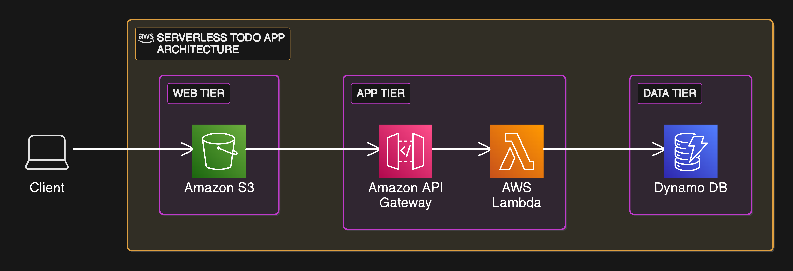

# Serverless Todo App

A simple, scalable, and cost-effective serverless Todo application built with a modern React frontend and AWS serverless backend services. This project demonstrates how to build a full-stack application using AWS Lambda, API Gateway, DynamoDB, and S3.

## Architecture

The application is built using a serverless architecture that separates the frontend and backend concerns:

- **Frontend**:

  - Built with **React** using **Vite** for a fast development experience.
  - Hosted on **Amazon S3** as a static website.

- **Backend**:
  - **AWS API Gateway**: Exposes RESTful API endpoints for interacting with the app.
  - **AWS Lambda**: Contains serverless functions for handling CRUD operations on Todo items.
  - **Amazon DynamoDB**: A NoSQL database used for storing tasks.
  - **CORS**: Configured in API Gateway and Lambda responses to allow cross-origin requests from the frontend.

## Technologies Used

- **Frontend**:

  - [React](https://reactjs.org/)
  - [Vite](https://vitejs.dev/)

- **Backend**:

  - [AWS Lambda](https://aws.amazon.com/lambda/)
  - [Amazon API Gateway](https://aws.amazon.com/api-gateway/)
  - [Amazon DynamoDB](https://aws.amazon.com/dynamodb/)

- **Hosting & Deployment**:

  - [Amazon S3](https://aws.amazon.com/s3/)

- **Other**:
  - AWS IAM for secure access management
  - CloudWatch Dashboard to show useful metric

